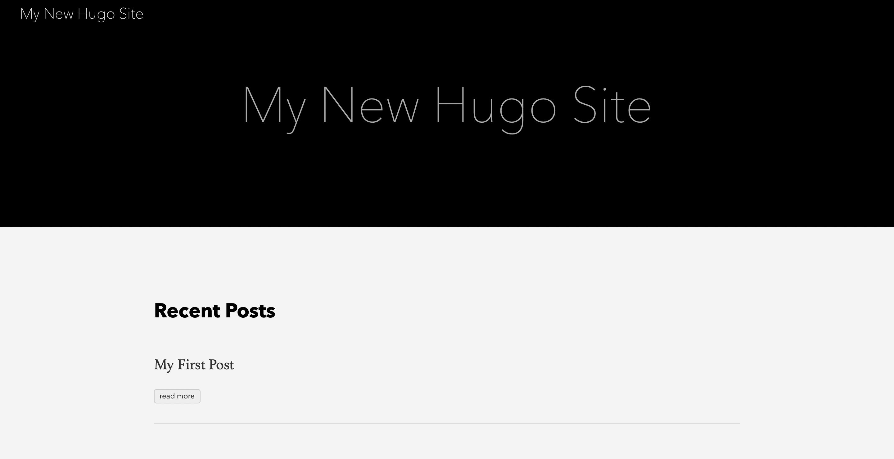
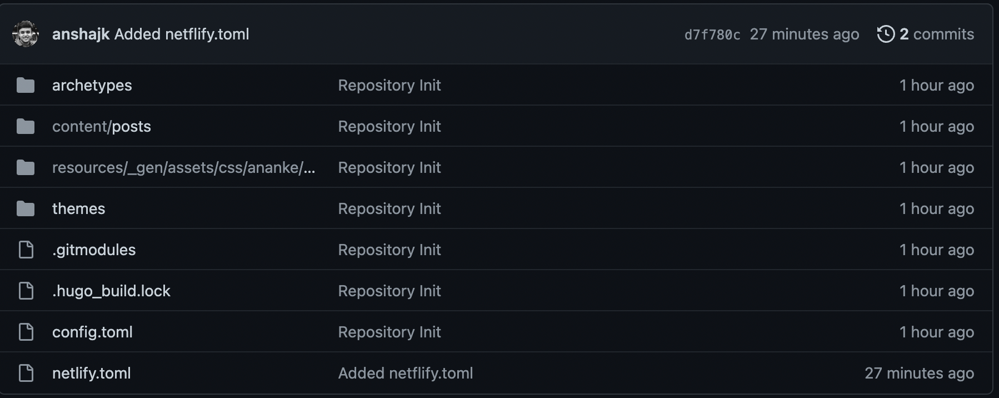
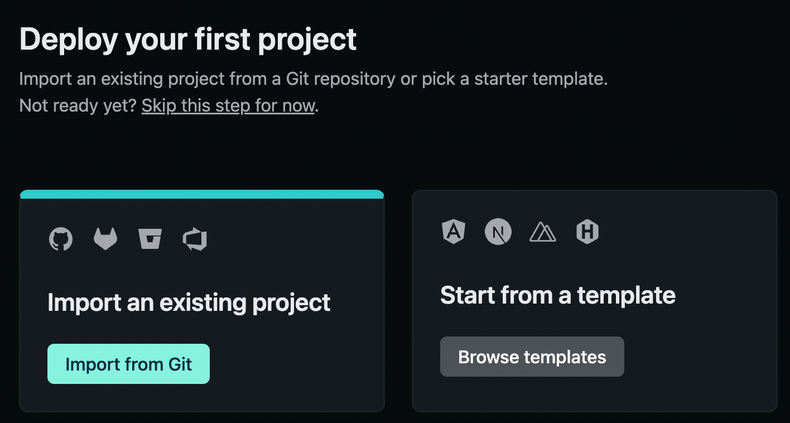
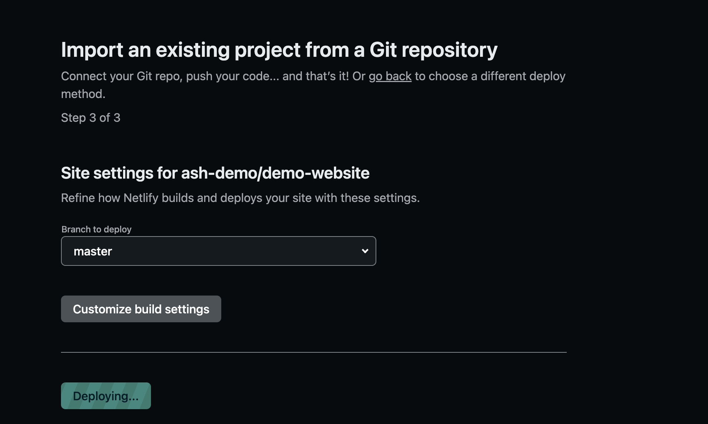
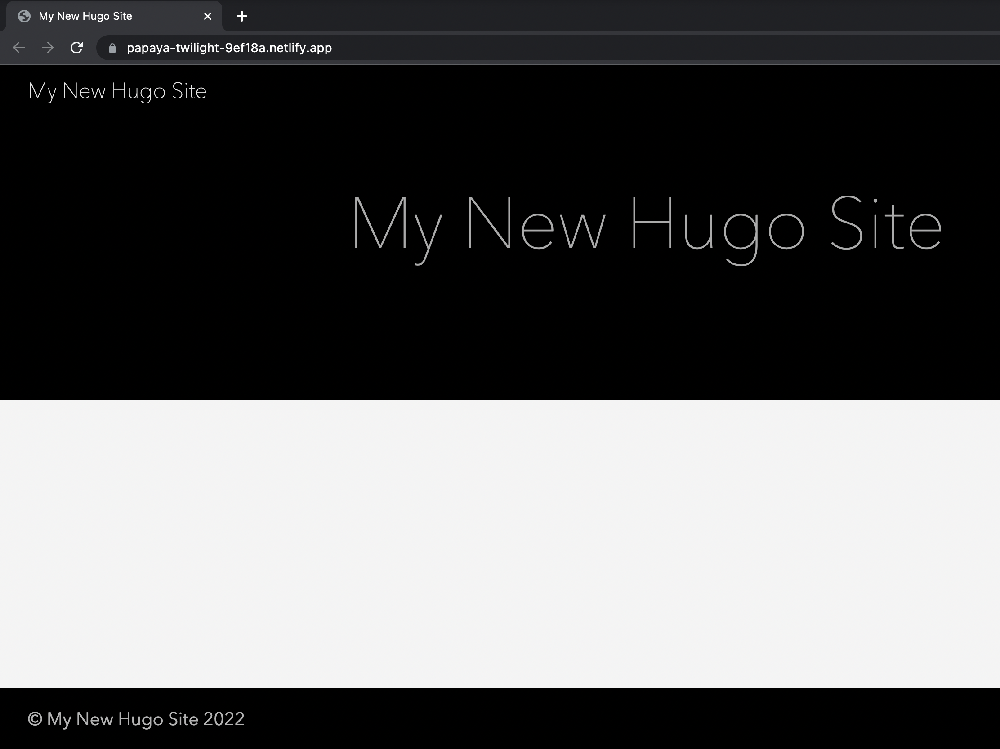

If you're like me and want an easy way to make and publish your website, this article is for you. I'll cover how I made and deployed this current site with minimal effort and zero investment. 

[Hugo](https://github.com/gohugoio/hugo) is a static HTML and CSS website generator written in [Go](https://golang.org/). It is optimized for speed, ease of use, and configurability. Hugo takes a directory with content and templates and renders them into a full HTML website.

Some of it's key features are

1. Relies on Markdown files with front matter for metadata
2. Renders a typical website of moderate size in a fraction of a second
3. Is designed to work well for any kind of website including blogs, tumbles, and docs

## Installation

Hugo is very simple to install. There are two things that you require

1. An installation of [Golang](https://go.dev)
2. Installation of Hugo  

Hugo can be easily installed if you have homebrew with 

```sh
brew install hugo
```

If you're not on Mac or you don't have homebrew to install software and dependencies, here's [the official installation documentation](https://gohugo.io/getting-started/installing/#quick-install).  


## Quick start

Bootstrapping a website is as simple as running the command below

```sh
hugo new site quickstart
```

The theme I'm using for this website is the [Anake theme](https://github.com/theNewDynamic/gohugo-theme-ananke). I'll explain how I set up this theme for this website. The complete list of themes for Hugo can be found at [themes.gohugo.io](https://themes.gohugo.io/)

Now, that we've picked up a theme, we'll do some quick setup by cloning the theme as a git submodule within our repository

```sh
cd quickstart
git init
git submodule add https://github.com/theNewDynamic/gohugo-theme-ananke.git themes/ananke
```

We need to add the theme to the site config 

```sh
echo theme = \"ananke\" >> config.toml
```

Let's now add some content to our site with 

```sh
hugo new posts/my-first-post.md
```

Let's now start the Hugo server with

```sh
hugo server -D
```

This is what should be visible when you navigate to localhost:1313



The website is now running locally on our machine. 

## Let's deploy

Websites can be hosted at a bunch of places easily. One of my favorite solutions to deploy my website for free is [netlify](https://www.netlify.com). You can sign up for a free account and have your website deployed in no time. 

The best part about Netflify is that setting up a continuous deployment pipeline from github is fairly straightforward. Netflify will build your wesbite for you, and deploy it, while providing you a DNS service, if you're planning to use a personal domain. So the only investment I had in hosting is buying my own domain, which I bought separately from [google domains](https://domains.google). I'd highly encourage you to get a domain for yourself, if you don't have one already. 

Here are the steps to deploy your freshly created website on netlify using github.

Prerequisites 

1. Github account
2. Netflify account

### Steps

1. Create a new file in your repo with the name _netflify.toml_ and add the following 

    ```toml
    [build]
    publish = "public"
    command = "hugo --gc --minify"

    [context.production.environment]
    HUGO_VERSION = "0.101.0"
    HUGO_ENV = "production"
    HUGO_ENABLEGITINFO = "true"

    [context.split1]
    command = "hugo --gc --minify --enableGitInfo"

    [context.split1.environment]
    HUGO_VERSION = "0.101.0"
    HUGO_ENV = "production"

    [context.deploy-preview]
    command = "hugo --gc --minify --buildFuture -b $DEPLOY_PRIME_URL"

    [context.deploy-preview.environment]
    HUGO_VERSION = "0.101.0"

    [context.branch-deploy]
    command = "hugo --gc --minify -b $DEPLOY_PRIME_URL"

    [context.branch-deploy.environment]
    HUGO_VERSION = "0.101.0"

    [context.next.environment]
    HUGO_ENABLEGITINFO = "true"

    [[redirects]]
    from = "/npmjs/*"
    to = "/npmjs/"
    status = 200
    ```

2. Check-in your code on github. Your repo should now look something like this

    

3. Open netlify and sign in with your github credentials. Alternatively, we can connect our github account later as well.
4. Now we need to allow netflify access to our repositories. We can follow the principle of least privilege here and only allow netlify access to the one repository containing our website code
5. Now, that we have our repo accessible from Netlify, Netlify will be able to see every time we push a new commit on github. This will ensure that our website is built and deployed automatically.

    
    
    

## Our deployed site

At the end of the build-deploy stage, our website will get deployed to a unique url generated by netlify. We can always set up our own domain using Netflify DNS, but I won't be covering that in this post. Our newly website should now be running and looking something like this



Hugo provides multiple features for easy creation of new posts, image processing etc. For full documentation, please refer the [official hugo docs](https://gohugo.io/documentation/)

_Thanks for reading!_